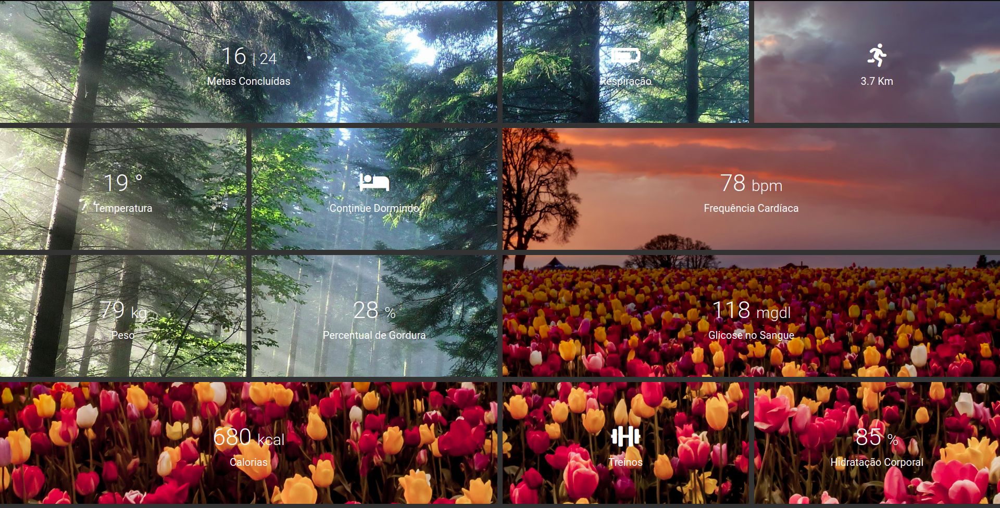

<h1 align="center">
    CSS Grid Layout Image Span
</h1>

<p align="center">	
  

  <a href="https://www.linkedin.com/in/yuripalacio/">
    
  </a>
  
  <a href="https://github.com/yuripalacio/grid-img-span/commits/master">
    
  </a>
  
  <a href="https://github.com/yuripalacio/mychat/blob/master/LICENSE">
    
  </a>
</p>

<p align="center">
  <a href="#sobre">Sobre</a>&nbsp;&nbsp;&nbsp;|&nbsp;&nbsp;&nbsp;
  <a href="#css-grid-image-span">CSS Grid Image Span</a>&nbsp;&nbsp;&nbsp;|&nbsp;&nbsp;&nbsp;
  <a href="#tecnologias">Tecnologias</a>&nbsp;&nbsp;&nbsp;|&nbsp;&nbsp;&nbsp;
  <a href="#referências">Referências</a>&nbsp;&nbsp;&nbsp;|&nbsp;&nbsp;&nbsp;
  <a href="#licença">Licença</a>
</p>

# Sobre

Com objetivo de estudo e entendimento das funcionalidades, foi desenvolvido um **Health Panel** aplicando o uso de grid e um span de imagens.
O interessantes desse processo é que a imagens é utilizada por inteira e cada bloco contempla uma parte dela. Basicamente a impressão que temos é de que a imagem foi utilizada por inteira e os blocos criados por cima dela.
Para deixar o processo ainda mais interessante, foram utilizados duas imagens.

<h1 align="center">
    
</h1>

# CSS Grid Image Span

Para criar a grid, utilizados o display grid com um template de 4 colunas.

```css
display: grid;
grid-template-columns: repeat(4, 1fr);
```

Para adicionar a imagens de fundo de forma que tenhamos o efeito de uma imagem inteira com os blocos por cima e não uma imagens por bloco, devemos utilizar a opção `brackground-attachment: fixed`. Dessa forma teremos o mesmo efeito que encontramos nesse projeto.

```css
/* Definimos as duas imágens de fundo */
.bg1 {
  background: url("./img/bg1.jpg");
}

.bg2 {
  background: url("./img/bg2.jpg");
}

/* Aplicamos o efeito desejado */
.container > div {
...
  background-size: cover;
  background-attachment: fixed;
...
}
```

No layout, podemos ver que alguns blocos ocupam mais de um espaço na grid.
Existem outra formas de conseguir esse resultado, nesse caso utilizamos [pseudo classes](https://www.w3schools.com/css/css_pseudo_classes.asp) `nth-of-type`.
Dessa forma conseguimos definir quantas colunas desejamos que nossa div ocupe.

```css
/* Primeira div ocupará 2 espaços */
.container > div:nth-of-type(1) {
  grid-column: 1 / 3;
}

/* Sexta div ocupará 2 espaços */
.container > div:nth-of-type(6) {
  grid-column: 3 / 5;
}

/* Nona div ocupará 2 espaços */
.container > div:nth-of-type(9) {
  grid-column: 3 / 5;
}

/* Décima div ocupará 2 espaços */
.container > div:nth-of-type(10) {
  grid-column: 1 / 3;
}
```

# Tecnologias

- HTML
- CSS

# Referências

<p>
https://www.youtube.com/watch?v=-qOe8lBAChE&t=103s

## Licença

Esse projeto está sob a licença MIT. Veja o arquivo <a href="https://github.com/yuripalacio/grid-img-span/blob/master/LICENSE">LICENSE</a> para mais detalhes.

<hr />

By [Yuri Palacio](https://www.linkedin.com/in/yuri-palacio/) :wave:
